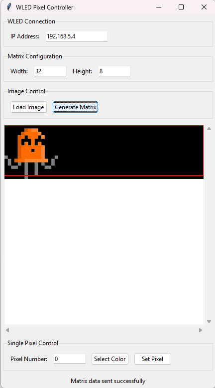
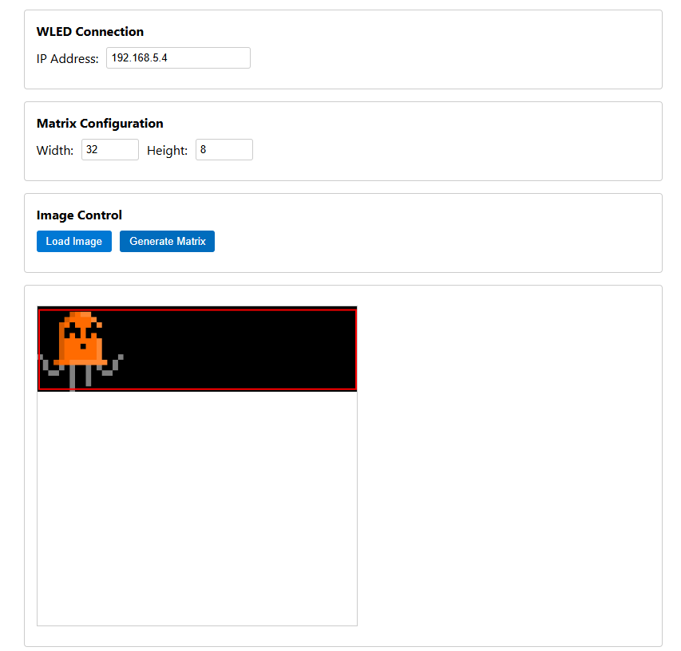

# WLEDImageSender
Easily send an image to a WLED matrix. Copilot wrote it.

1. Choose the ip of your WLED matrix
2. Specify a matrix size
3. Load an image
4. Drag your bounding box around, drag outside it to scale
5. Click Generate Matrix to generate and send

Alternativly there is an html version you can run standalone or add it to your WLED device through the /edit page

I was playing around with sending single pixels so that is an option at the bottom too. This will show the rquest and the response.

## Settings

## Web version

## Results
